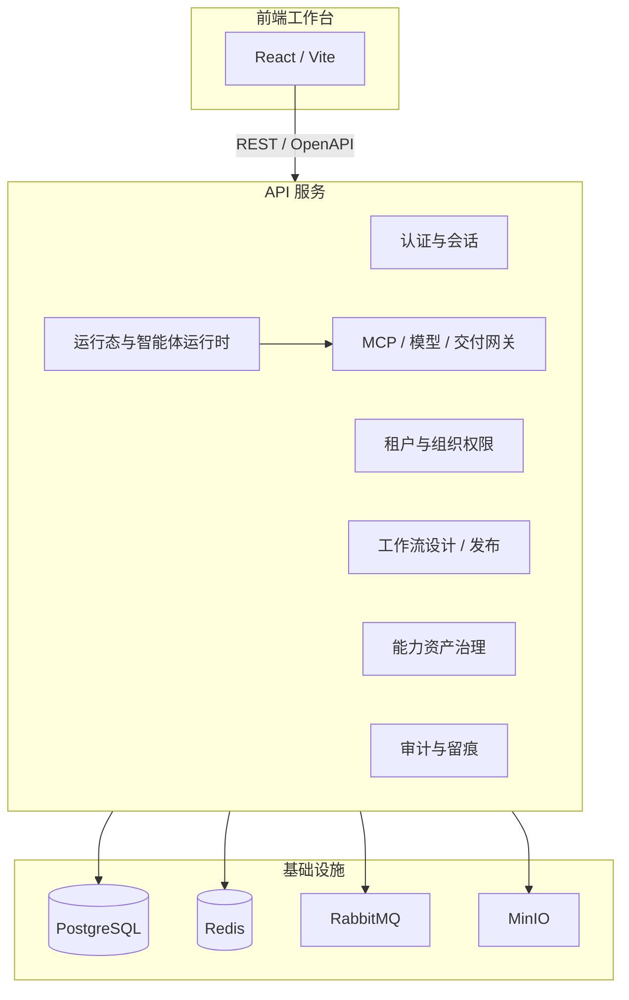
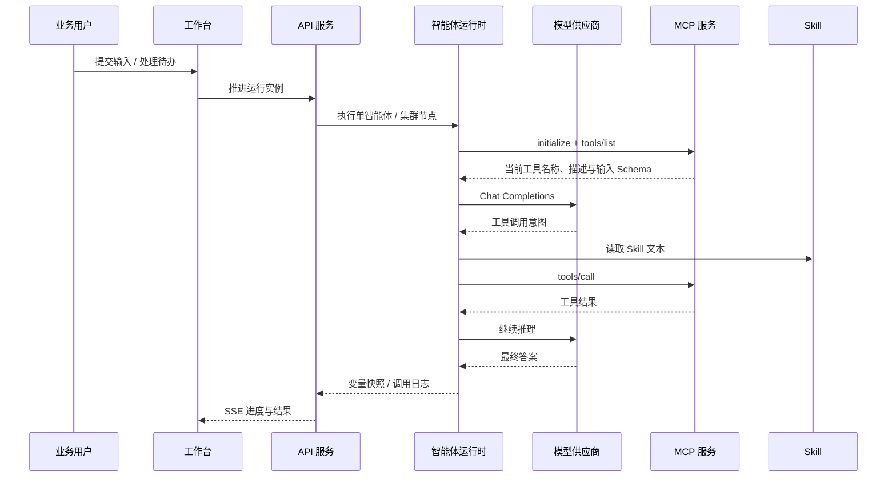
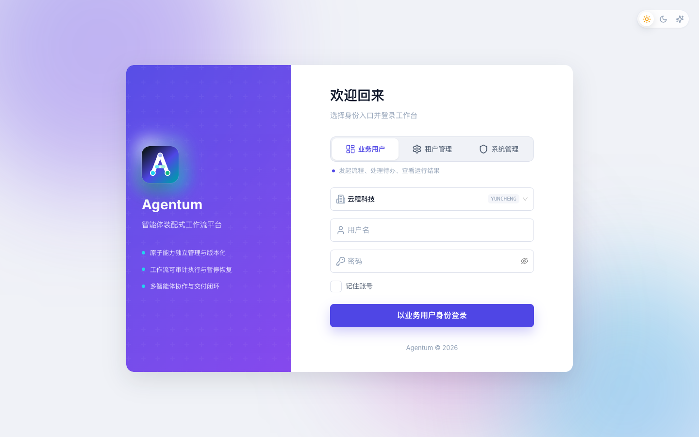
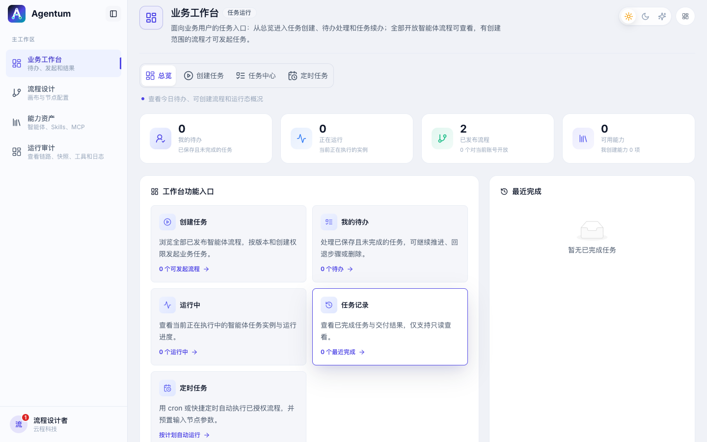
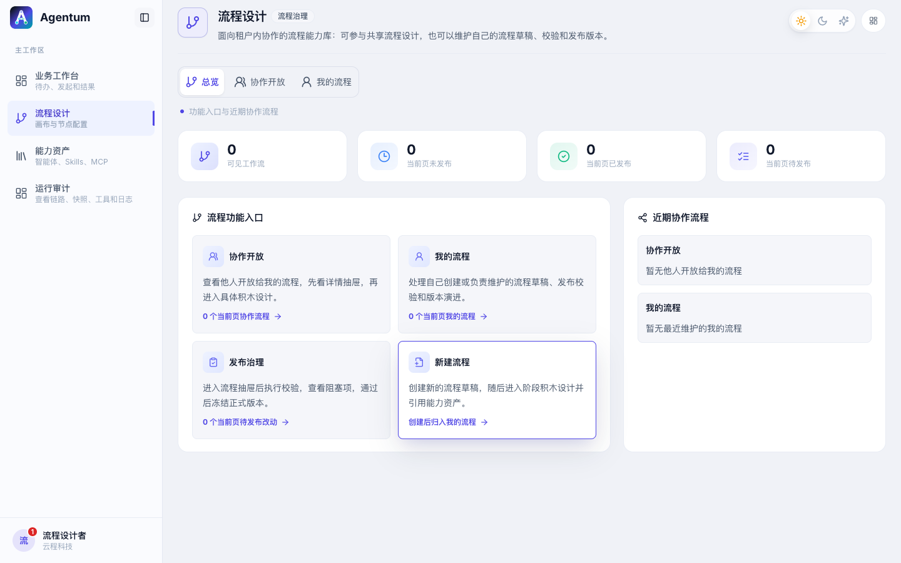
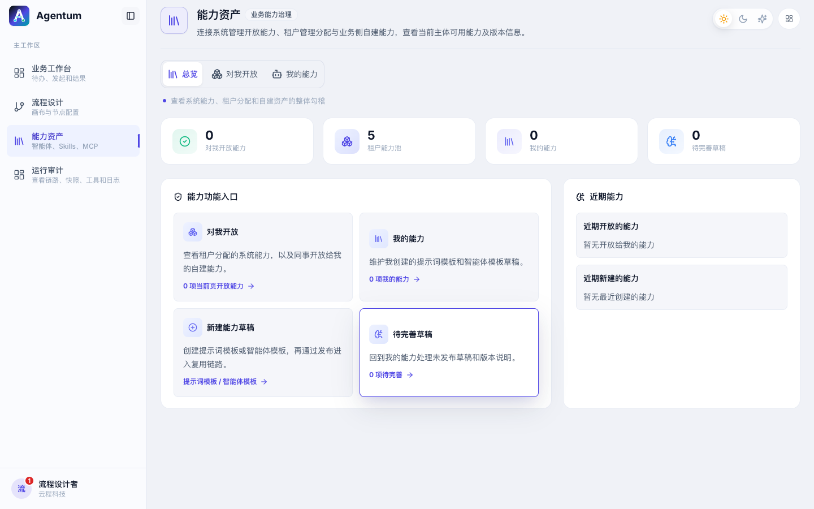
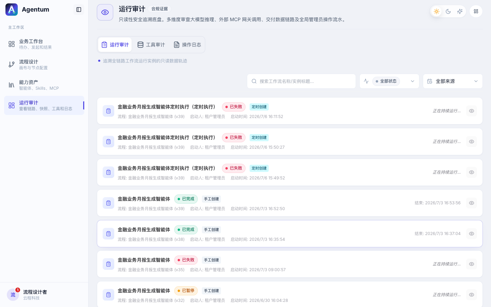
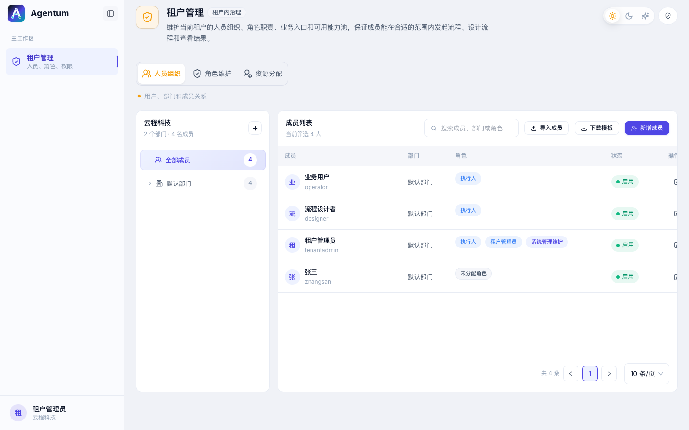
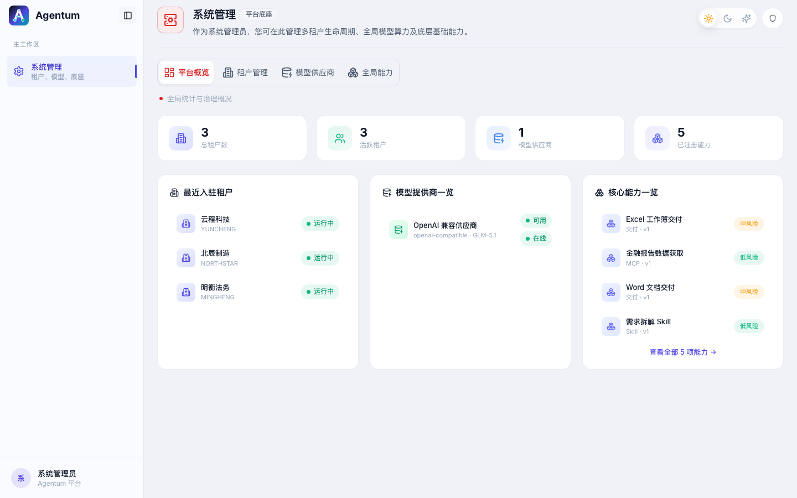

# Agentum

**面向企业流程的多智能体协作平台**

[](LICENSE)
[](https://openjdk.org/)
[](https://react.dev/)
[](https://spring.io/projects/spring-boot)
[](https://www.postgresql.org/)

Agentum 不是把业务流程拆成大量低代码节点，也不是把一件复杂任务直接丢给一个模型临时生成 subagent。它的核心思路是：**企业先沉淀可治理的智能体、Skill、MCP 和提示词资产，再用少量业务步骤把这些能力组织起来，让多个专门智能体协作完成复杂任务。**

相比 Dify 这类偏“流程节点编排”的产品，Agentum 希望减少分支、变量、工具调用节点对业务人员的打扰。设计者只需要关心几个关键步骤：用户输入、单智能体处理、智能体集群协作、人工审核和最终交付。真正的工具选择、信息补全、章节生成、风险分析等细节，由节点里的智能体根据上下文自主完成。

相比直接使用大模型自己的 subagent / multi-agent 能力，Agentum 更强调企业可维护性。每个智能体不是一次对话里的临时角色，而是可登记、可发布、可分配、可审计的资产。这样即使模型能力没有强到可以独立规划全部任务，也能通过“资料核验智能体、风险分析智能体、报告撰写智能体、结论汇总智能体”等明确分工协作，把复杂任务拆给多个能力较弱但职责清晰的模型/智能体完成。

当前项目已完成**阶段一：框架与基础治理**，并持续在运行态、交付能力和工作台体验上迭代。**下一阶段重点转向「知识资产」**：把企业文档纳入可治理、可检索、可被智能体引用的资产体系，与现有能力资产和流程设计打通。

阶段进度与验收记录见 [当前进度](./docs/progress/README.md)。

## 产品亮点

- **以智能体配置代替繁琐流程编排**：流程不追求把每个工具调用画成节点，而是把 AI 能力封装进智能体模板、提示词模板、Skill 和 MCP，让流程保持业务可读。
- **多 Agent 是企业资产，不是临时提示词角色**：智能体模板可以创建、发布、共享和授权；流程引用的是被治理过的能力，而不是一次性写在 prompt 里的角色描述。
- **弱模型也能协作完成复杂任务**：通过智能体集群节点把任务拆给多个子智能体，分别处理数据获取、事实核验、分析判断、内容生成和汇总，降低对单个超强模型的依赖。
- **业务步骤清晰，AI 细节留在节点内部**：业务用户看到的是输入、待办、审核、运行进度和交付物；设计者看到的是阶段积木和能力选择；审计人员看到的是证据链。
- **从第一版内建企业治理**：多租户、系统管理、租户管理、能力池分配、资源范围、发布校验、运行留痕和交付记录都是基础模型的一部分。
- **适合客户系统集成**：邮箱、Webhook、Word 文档和 Excel 工作簿作为通用交付先内置；OA、PDF、IM、专属数据源等按客户环境通过 MCP 或交付适配器扩展。

## 核心工作方式

```text
沉淀能力资产
  -> 设计少量业务步骤
  -> 单智能体或多智能体集群执行
  -> 人工输入 / 审核介入
  -> 交付结果并保留证据链
```

一个典型流程可以是：

```text
输入企业名称
  -> 资料核验智能体调用可用 MCP 获取事实数据
  -> 多个分析智能体并行生成风险、财务、行业和司法章节
  -> 汇总智能体统一口径
  -> 人工审核
  -> 生成 Word 报告 / Excel 明细并通过邮件或 Webhook 交付
```

这里的重点不是把每个查询、判断、拼接都变成流程节点，而是维护好每类智能体的职责、可用工具和输出约束。

## 系统架构概览



运行态一次智能体调用的典型链路：



更完整的模块边界、数据模型和部署演进见 [架构文档](./docs/architecture.md)。

## 产品界面预览

本地启动前后端后（默认 `http://localhost:5173`），可对照以下界面理解三类入口与核心模块：

| 界面 | 说明 |
| --- | --- |
| 登录与租户选择 | 业务用户 / 租户管理需选租户，系统管理不绑定租户 |
| 业务工作台 | 待办、流程发起、运行详情、定时任务与交付物 |
| 流程设计 | 阶段积木编排、智能体配置、发布校验 |
| 能力资产 | 智能体模板、Skill、MCP、提示词与交付能力 |
| 运行审计 | 运行记录、模型 / MCP 调用、变量快照与交付证据 |
| 租户管理 | 成员与部门、角色维护、页签与能力分配 |
| 系统管理 | 租户状态、模型供应商、全局能力、租户能力池与附件识别配置 |















截图由本地开发环境自动采集，仅作产品形态参考；具体菜单与数据以当前版本为准。

## 已完成的阶段一能力

- 三类入口：业务用户、租户管理、系统管理。
- 多租户认证、角色切换、菜单驱动和租户上下文校验。
- 系统管理：租户、模型供应商、全局能力、租户能力池和模型分配。
- 租户管理：成员、部门、角色、页签分配、能力池分配和组织勾稽。
- 能力资产：智能体模板、提示词模板、Skill、MCP、交付能力的展示、发布和授权边界。
- 流程设计：草稿、阶段积木、变量声明、发布校验、不可变版本和协作权限。
- 运行态：用户输入、人工审核、单智能体、多智能体集群、追问、重新执行、失败恢复。
- 智能体运行：模型调用、Skill 读取、MCP 工具调用、推理内容、Token 用量和最终答案留痕。
- 基础交付：邮箱、Webhook、Word 文档和 Excel 工作簿生成下载。
- 审计证据链：运行事件、变量快照、模型调用、MCP 调用和交付记录。

### 近期补充（2026-07）

- 智能体集群意图分派、多交付项与 Excel / Word 在线预览。
- 流程草稿导入导出、积木插入 / 复制与配置校验增强。
- 输入节点附件上传、MinIO 保存、本地 / MinerU 可选识别，以及按 PDF、图片、Word、Excel、文本适配的在线预览。
- 定时任务、通知中心、个人资料与密码修改。
- 工具调用执行历史展示优化，角色切换与主题切换统一收纳到左下角人物菜单。

## 下一阶段：知识资产

阶段一已把智能体模板、Skill、MCP、提示词和交付能力纳入「能力资产」治理。下一阶段将在同一权限与版本模型下扩展**知识资产**：

- 支持企业文档上传、解析、分块与版本管理。
- 与租户能力池、资源范围和能力分配打通，控制谁可检索、引用哪些知识。
- 在智能体节点中按流程上下文检索并引用文档片段，写入审计证据链。
- 逐步把现有 `docs/` 产品文档作为首批知识资产样例引入，验证检索质量与引用边界。

详细计划与任务拆分见 [当前进度](./docs/progress/README.md#31-下一阶段知识资产)。

## 参与贡献与提交 PR

欢迎通过 Pull Request 参与开发。提交前请先阅读 [开发规范](./docs/development-standards.md) 与 [AGENTS.md](./AGENTS.md)。

推荐流程：

1. 从 `main` 拉取最新代码，创建功能分支，例如 `feat/knowledge-asset-upload`。
2. 按任务范围修改代码或文档，保持改动聚焦；注释、错误提示与日志默认使用中文。
3. 根据影响范围执行验证：
   - 前端：`pnpm lint:web`、`pnpm build:web`
   - 后端：`./gradlew test`
   - 文档：`git diff --check`
4. 推送分支到远端，在 GitHub 创建 Pull Request。若已安装 [GitHub CLI](https://cli.github.com/)，可在仓库根目录执行：

```bash
git push -u origin HEAD
gh pr create --title "简要说明本次改动" --body "$(cat <<'EOF'
## Summary
- 改动要点 1
- 改动要点 2

## Test plan
- [ ] 已运行的验证命令或手工检查项

EOF
)"
```

PR 描述请说明业务背景、验证方式和剩余风险；涉及权限、租户上下文或运行态语义变更时，同步更新 `docs/progress/README.md` 或相关长期文档。

## 技术栈

| 层 | 技术 |
| --- | --- |
| 前端 | React、TypeScript、Vite、Tailwind CSS、Ant Design、Zustand |
| 后端 | Java 21、Spring Boot、Spring Security、Spring Data JPA |
| 数据 | PostgreSQL、Flyway |
| 运行依赖 | Redis、RabbitMQ、MinIO、Mailpit |
| 契约 | OpenAPI、JSON Schema |
| 能力源码 | `capabilities/skills`、`capabilities/mcp-servers`、`capabilities/delivery` |

## 快速开始

安装依赖：

```bash
pnpm install
```

启动本地基础设施：

```bash
make dev-infra
```

启动后端：

```bash
./gradlew :apps:api:bootRun
```

本地 `local` profile 默认只输出控制台日志，不创建日志文件。如需专门验证文件分流，可临时启用：

```bash
SPRING_PROFILES_ACTIVE=local,logfile AGENTUM_LOG_PATH=./logs ./gradlew :apps:api:bootRun
```

启动前端：

```bash
pnpm dev:web
```

常用验证：

```bash
pnpm lint:web
pnpm build:web
./gradlew test
git diff --check
```

## Docker 部署

当前 Docker 部署按“本地构建镜像、服务器加载镜像、通过环境变量区分测试和正式”的方式组织。`docker-compose.yml` 不在服务器上构建代码，只引用已加载的镜像：

```text
agentum-api:latest
agentum-web:latest
```

### 本地构建 Linux 镜像

Mac 构建、Linux 服务器运行时，需要显式指定目标平台。常见 x86_64 服务器使用 `linux/amd64`：

```bash
docker buildx build --platform linux/amd64 \
  -t agentum-api:latest \
  -f deploy/docker/api.Dockerfile \
  --load .

docker buildx build --platform linux/amd64 \
  -t agentum-web:latest \
  -f deploy/docker/web.Dockerfile \
  --load .
```

导出镜像文件：

```bash
mkdir -p dist/docker-images
docker save agentum-api:latest -o dist/docker-images/agentum-api-latest-linux-amd64.tar
docker save agentum-web:latest -o dist/docker-images/agentum-web-latest-linux-amd64.tar
docker pull --platform linux/amd64 postgres:15-alpine
docker pull --platform linux/amd64 redis:7-alpine
docker pull --platform linux/amd64 rabbitmq:3.13-management-alpine
docker pull --platform linux/amd64 minio/minio:RELEASE.2024-10-13T13-34-11Z
docker save \
  postgres:15-alpine \
  redis:7-alpine \
  rabbitmq:3.13-management-alpine \
  minio/minio:RELEASE.2024-10-13T13-34-11Z \
  -o dist/docker-images/agentum-runtime-linux-amd64.tar
```

### 服务器加载镜像

把 `dist/docker-images/*.tar`、`docker-compose.yml` 和 `.env.example` 上传到服务器后执行：

```bash
docker load -i agentum-api-latest-linux-amd64.tar
docker load -i agentum-web-latest-linux-amd64.tar
docker load -i agentum-runtime-linux-amd64.tar
```

数据库迁移脚本不需要单独上传。Flyway 迁移 SQL 已打包在 API 镜像的 jar 中，API 启动时会从 `classpath:db/migration/schema` 自动执行；生产环境不会加载 `devdata` 演示数据。

### 测试部署

测试部署用于验收镜像、数据库迁移、登录初始化、模型/MCP/交付配置和端到端流程。测试环境使用 `prod,logfile`，既避免加载本地演示数据，也保留可滚动的服务器日志文件：

```bash
cp .env.example .env.test
```

编辑 `.env.test`，至少修改：

```env
WEB_HTTP_PORT=8088
AGENTUM_API_PROFILES=prod,logfile
AGENTUM_LOG_HOST_PATH=./logs
AGENTUM_DOCKER_NETWORK=agentum-test
AGENTUM_AUTH_SSO_API_BASE_URL=http://测试服务器IP:8088
AGENTUM_AUTH_SSO_WEB_BASE_URL=http://测试服务器IP:8088
AGENTUM_CORS_ALLOWED_ORIGIN_PATTERNS=http://测试服务器IP:8088
AGENTUM_AUTH_REFRESH_COOKIE_SECURE=false
POSTGRES_PASSWORD=测试库强密码
RABBITMQ_PASSWORD=测试队列强密码
MINIO_SECRET_KEY=测试对象存储强密码
AGENTUM_AUTH_TOKEN_SECRET=测试环境独立随机值
AGENTUM_AUTH_SSO_STATE_SECRET=测试环境独立随机值
AGENTUM_FIELD_ENCRYPTION_MASTER_KEY=测试环境独立随机值
```

启动：

```bash
docker compose --env-file .env.test up -d
docker compose --env-file .env.test ps
docker compose --env-file .env.test logs -f api
```

### 正式部署

正式部署用于真实用户、真实业务数据、真实密钥和正式交付物。正式环境必须使用 HTTPS 域名和独立强随机密钥：

```bash
cp .env.example .env.prod
```

编辑 `.env.prod`，至少修改：

```env
WEB_HTTP_PORT=80
AGENTUM_API_PROFILES=prod,logfile
AGENTUM_LOG_HOST_PATH=./logs
AGENTUM_DOCKER_NETWORK=agentum-prod
AGENTUM_AUTH_SSO_API_BASE_URL=https://正式域名
AGENTUM_AUTH_SSO_WEB_BASE_URL=https://正式域名
AGENTUM_CORS_ALLOWED_ORIGIN_PATTERNS=https://正式域名
AGENTUM_AUTH_REFRESH_COOKIE_SECURE=true
POSTGRES_PASSWORD=正式库强密码
RABBITMQ_PASSWORD=正式队列强密码
MINIO_SECRET_KEY=正式对象存储强密码
AGENTUM_AUTH_TOKEN_SECRET=正式环境独立随机值
AGENTUM_AUTH_SSO_STATE_SECRET=正式环境独立随机值
AGENTUM_FIELD_ENCRYPTION_MASTER_KEY=正式环境独立随机值
```

启动：

```bash
docker compose --env-file .env.prod up -d
docker compose --env-file .env.prod ps
docker compose --env-file .env.prod logs -f api
```

`docker compose logs api` 继续读取容器标准输出；文件日志通过 `AGENTUM_LOG_HOST_PATH` 持久化到宿主机：

```text
logs/system/agentum-system.log
logs/tenant/agentum-tenant.log
```

系统文件记录启动、基础设施和平台级操作；租户文件只接收已校验租户上下文的业务请求与异步任务，并通过 `tenantId`、`userId`、`requestId`、`runId` 等字段区分链路。两个文件均按日期或大小滚动并压缩，具体上限可通过 `.env.example` 中的 `AGENTUM_LOG_*` 参数调整。

本地通常只启动基础设施并用 `bootRun` 运行 API，因此默认不落盘；如果本地启动完整 Compose 也不需要文件，把 `AGENTUM_API_PROFILES` 改为 `prod` 即可。

首次正式部署使用空库启动后，访问 `/setup` 创建首个系统管理员。`AGENTUM_FIELD_ENCRYPTION_MASTER_KEY` 一旦用于加密模型密钥、SSO Secret 或外部交付凭证，就不能在未做密文迁移的情况下直接更换。

### 演示账号

`local` profile 加载本地演示数据，初始密码均为 `agentum123`。

| 用户名 | 入口 | 租户 |
| --- | --- | --- |
| `admin` | 系统管理 | 不绑定 |
| `operator` | 业务用户 | 云程科技 |
| `designer` | 业务用户 | 云程科技 |
| `tenantadmin` | 租户管理 | 云程科技 |

如果使用不加载 `devdata` 的空库首次启动，前端会进入 `/setup` 初始化页，创建首个系统管理员账号后再通过“系统管理”入口登录。

## 目录结构

```text
apps/web                  前端工作台
apps/api                  后端 API
packages/shared-contract  OpenAPI、JSON Schema 与事件契约
capabilities/             产品运行时能力源码
workers/                  后续长耗时任务 Worker
deploy/                   部署与本地配置
docs/                     产品、架构和进度文档
```

根目录每个配置文件、子目录职责与完整目录树见 **[项目目录说明](./docs/project-structure.md)**。

## 文档

| 文档 | 说明 |
| --- | --- |
| [项目目录说明](./docs/project-structure.md) | 根目录文件、子目录职责与完整目录树 |
| [系统介绍](./docs/system-overview.md) | 产品定位、角色视角、工作流与能力资产 |
| [架构文档](./docs/architecture.md) | 模块边界、数据模型、部署演进 |
| [开发规范](./docs/development-standards.md) | 命名、接口、测试与 AI 协作约定 |
| [能力—流程—权限治理](./docs/capability-workflow-governance.md) | 版本模型、引用勾稽、收回/删除与后续选型 |
| [AI 运行态接入说明](./docs/ai-runtime-integration.md) | 模型、MCP、Skill、提示词模板与流程运行时 |
| [Skill 与 MCP 运行机制](./docs/skill-mcp-runtime-guide.md) | Skill 读取、MCP 工具发现与调用、参数 Schema、失败恢复和审计 |
| [运行态异步执行设计](./docs/runtime-async-execution-design.md) | 执行解耦、SSE 回放与中断/恢复语义 |
| [Word 文档交付说明](./docs/word-document-delivery.md) | 系统内置 Word 交付的配置、预览和下载 |
| [Excel 工作簿交付说明](./docs/excel-workbook-delivery.md) | 系统内置 Excel 交付的 Sheet 模板、宽容解析和下载 |
| [企业 SSO 对接说明](./docs/sso-integration.md) | OIDC 单点登录边界与当前实现 |
| [OA Basic 单点登录示例](./docs/oa-basic-sso-integration.md) | OA 服务端 Basic 换取一次性浏览器地址的配置、Java 示例与联调说明 |
| [当前进度](./docs/progress/README.md) | 阶段计划、完成状态和后续开发说明 |
| [AGENTS.md](./AGENTS.md) | 仓库内 AI 代理开发入口 |

## License

本项目采用 [MIT License](./LICENSE)。
