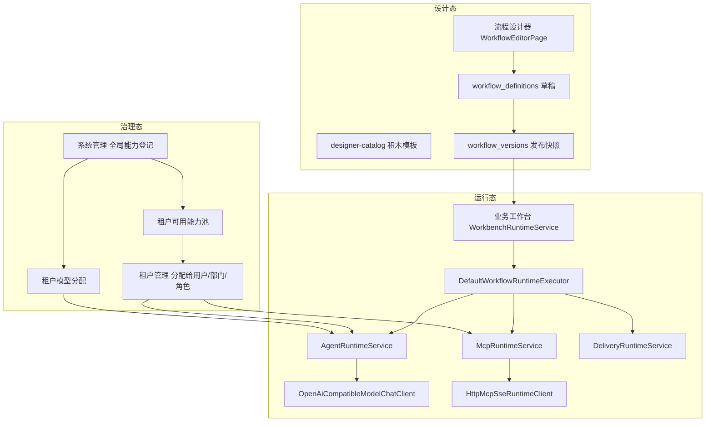

# AI 运行态接入说明

更新时间：2026-06-05

本文档说明 **当前代码** 如何把业务流程与 AI 模型、MCP、提示词模板等能力关联起来，重点回答：

- 流程跑到智能体节点时，谁在调用模型？
- MCP / Skill / 提示词模板分别落在哪一层？
- 调用结果写到哪里、前端从哪里看到？

长期架构原则见 [架构文档](./architecture.md)；能力治理见 [能力—流程—权限治理](./capability-workflow-governance.md)。

---

## 1. 一句话结论

当前第一版运行态的真实链路是：

```text
业务工作台发起任务
  -> 基于已发布流程版本生成不可变运行快照
  -> WorkbenchRuntimeService 按节点顺序推进
  -> 遇到用户输入 / 人工审核：暂停并生成待办
  -> 遇到智能体 / 集群 / 交付：交给 WorkflowRuntimeExecutor
       -> 先调 MCP（如节点配置了 mcpIds）
       -> 再调租户已分配模型（OpenAI 兼容 Chat Completions）
       -> 或执行交付能力（站内 / 邮件 / Webhook）
  -> 节点输出写入变量快照、模型/MCP/交付日志
  -> 前端运行详情只读展示后端结果
```

**Skill 当前只完成治理与源文件探测，尚未进入智能体运行时的 prompt 注入或工具编排。**

---

## 2. 总体架构



### 2.1 三层边界

| 层 | 职责 | 当前状态 |
| --- | --- | --- |
| 设计态 | 配置节点、提示词、MCP、Skill 引用、变量 | 已接入 |
| 治理态 | 登记能力、放入租户池、分配给主体、分配模型 | 已接入 |
| 运行态 | 真正调用模型 / MCP / 交付并留痕 | 第一版已接入，Skill 运行时未接入 |

---

## 3. 从发起到执行的完整链路

### 3.1 发起任务

入口：

- 前端：`apps/web/src/surfaces/workbench/WorkbenchShell.tsx`
- API：`POST /api/tenants/{tenantId}/workbench/runs`
- 服务：`WorkbenchRuntimeService.createRun`

关键行为：

1. 读取流程**最新发布版本** `workflow_versions.definition_snapshot`，不回读可变草稿。
2. 创建 `workflow_runs`、`workflow_node_runs`。
3. 调用 `advanceUntilPause(...)` 从第一个节点开始推进。

### 3.2 节点推进规则

`WorkbenchRuntimeService.advanceUntilPause` 按 `sort_order` 遍历节点：

| 节点类型 | 行为 |
| --- | --- |
| `user_input` / `human_review` | 标记节点 `waiting`，运行态 `paused`，写 `workflow_waiting_events` 待办 |
| `agent` / `parallel_group` / `delivery` / `trigger` / `condition` / `merge` | 标记 `running`，调用 `WorkflowRuntimeExecutor` |
| 全部完成 | 运行态 `completed` |
| 执行抛错 | 节点 `failed`，运行态 `failed` |

人工节点不会直接调 AI；AI 相关调用只发生在自动执行节点。

### 3.3 节点执行分发

`DefaultWorkflowRuntimeExecutor` 是运行态汇聚入口：

```text
trigger      -> 本地生成占位输出
agent        -> MCP 先执行，再执行 AgentRuntimeService
parallel_group -> 逐个 clusterAgents 子配置：每个子智能体同样 MCP -> Agent
delivery     -> DeliveryRuntimeService
condition    -> 本地记录表达式
merge        -> 本地透传/合并变量
```

对应代码：

- `apps/api/src/main/java/com/agentum/workbench/application/DefaultWorkflowRuntimeExecutor.java`

---

## 4. 模型调用：智能体如何与 AI 交互

### 4.1 触发时机

只有以下路径会真正访问大模型：

- 单智能体节点 `agent`
- 智能体集群节点 `parallel_group` 中的每个子智能体

执行服务：`AgentRuntimeService.execute`

### 4.2 配置来源

节点执行时会合并两类配置：

1. **节点发布快照里的 `config_snapshot`**
   - `systemPrompt` / `userPrompt`
   - `systemPromptTemplateId` / `userPromptTemplateId`
   - `agentAssetId`（引用已发布智能体模板）
   - `modelName` / `temperature` / `maxTokens`
   - `mcpIds`（MCP 在 Agent 之前由 `McpRuntimeService` 处理）

2. **智能体模板资产**
   - 若 `agentAssetId` 指向租户内已发布 `agent_template`，先展开其 `config`，再被节点内联配置覆盖。

对应代码：

- `AgentRuntimeService.expandAgentConfig`
- `AgentRuntimeService.resolvePromptContent`

### 4.3 租户模型分配

模型不是节点里随便填 URL，而是：

1. 系统管理员在**系统管理**登记模型供应商 `model_providers`
2. 为租户启用模型分配 `tenant_model_assignments`
3. 运行时 `AgentRuntimeService.resolveTenantModelAssignment` 取当前租户**第一个 enabled** 的分配
4. 解密供应商 API Key，调用统一聊天客户端

这意味着：**当前租户只能用到系统分配的那套模型供应商**；节点可覆盖 `modelName`，但不能绕过租户分配。

### 4.4 Prompt 组装方式

当前实现是 **单轮 Chat Completions**，不是 Agent Loop，也不是原生 Function Calling：

```text
system message = 渲染后的 systemPrompt
user message   = 渲染后的 userPrompt
                 + 上游变量 JSON
                 + MCP 工具结果 JSON
```

模板变量替换规则：

- 支持 `{{变量名}}`
- 变量来自上游已完成节点输出 + MCP 输出

对应代码：

- `AgentRuntimeService.renderTemplate`
- `OpenAiCompatibleModelChatClient`

### 4.5 支持的供应商协议

`OpenAiCompatibleModelChatClient` 当前支持：

| providerType | 协议 |
| --- | --- |
| `openai-compatible` | OpenAI Chat Completions |
| `dashscope-compatible` | 通义等 OpenAI 兼容网关 |
| `azure-openai` | Azure OpenAI Chat Completions |
| `anthropic-compatible` | **运行态暂不支持** |

请求路径默认 `/chat/completions`，可在供应商 `settings` 或节点配置中覆盖。

### 4.6 模型输出写到哪里

成功后 `AgentRuntimeService` 生成节点输出：

| 字段 | 含义 |
| --- | --- |
| `output` / `outputVariable` | 节点声明的输出变量名，默认 `agent_response` |
| `summary` | 截断后的摘要，供工作台 UI 展示 |
| `modelCallLogId` | 关联 `model_call_logs` |
| `modelName` | 实际使用的模型 |

同时写入：

- `model_call_logs`：prompt 快照、响应快照、token usage、耗时、失败原因
- `variable_snapshots`：非敏感输出变量
- `workflow_node_runs.output_snapshot`
- `workflow_run_events`：`node_completed` / `node_failed`

---

## 5. MCP：外部工具如何接入

### 5.1 治理链路

```text
capabilities/mcp-servers/<server-key>   # 自研 MCP 源码
  -> 系统管理登记为 system_capabilities(capability_type=mcp)
  -> 放入租户可用能力池 tenant_capability_grants
  -> 租户管理分配给用户/部门/角色 resource_grants
  -> 流程设计节点配置 mcpIds
  -> 发布版本冻结到 config_snapshot
```

设计态保存/发布时，`WorkflowNodeConfigValidator` 会校验：

- MCP 是否在租户能力池内
- 当前设计者是否被分配了该 MCP

### 5.2 运行时调用顺序

对 `agent` 节点：

```text
1. McpRuntimeService.executeConfiguredMcps
2. AgentRuntimeService.execute（把 MCP 输出拼进 user prompt）
```

也就是说：**当前 MCP 不是模型原生 tool call，而是“先调工具，再把结果喂给模型”**。

### 5.3 节点配置字段

`config_snapshot` 中常见字段：

| 字段 | 作用 |
| --- | --- |
| `mcpIds` / `mcpServices` | 绑定的 MCP 能力 ID 列表 |
| `toolName` / `mcpToolName` | 要调用的 MCP 工具名 |
| `toolArguments` / `arguments` | 工具参数，可写 `{{变量名}}` |
| `mcpOutput` | 输出变量名，默认用能力 `code` |

若选了 MCP 但没配 `toolName`，运行时会 **跳过真实调用**，在 `mcp_call_logs` 记 `skipped`。

### 5.4 运行时协议

实现类：`HttpMcpSseRuntimeClient`

协议步骤：

1. 连接 MCP 的 `sseUrl`
2. 读取 SSE endpoint
3. 发送 JSON-RPC `initialize`
4. 发送 `notifications/initialized`
5. 发送 `tools/call`
6. 解析工具结果

安全与治理：

- 校验 MCP 属于当前租户能力池
- 请求/日志中对敏感字段脱敏
- 全量写入 `mcp_call_logs`

### 5.5 本地演示 MCP

仓库自带演示服务：

- `capabilities/mcp-servers/agentum-test-mcp/`
- 需在系统管理中登记其 SSE 地址后，才能在流程节点里选用

---

## 6. Skill：当前做到哪一步

### 6.1 现在已有什么

Skill 在当前代码里主要是 **资产与治理对象**，不是运行时执行器：

| 能力 | 状态 |
| --- | --- |
| 系统管理登记 Skill | 已支持 |
| 读取 `capabilities/skills/<key>/SKILL.md` + `skill.yaml` 探测 | 已支持 |
| 租户能力池 / 分配 | 已支持 |
| 流程设计器选择 `skillIds` | 已支持 |
| 发布校验引用是否在能力池内 | 已支持 |
| 运行时把 Skill 注入模型 prompt / 作为 tool | **未实现** |

对应代码：

- 探测：`FilesystemSkillManifestProbe`
- 设计态校验：`WorkflowNodeConfigValidator`
- 运行时：`AgentRuntimeService` 中 **没有** `skillIds` 处理逻辑

### 6.2 设计意图

按架构规划，Skill 未来应作为：

- 可版本化的方法论 / 提示词片段 / 操作指南
- 在智能体执行前展开到 system prompt 或中间推理步骤
- 与 `capabilities/skills/` 源码目录和数据库资产表保持勾稽

但第一版为了先打通「流程 -> 模型 -> MCP -> 交付」闭环，**Skill 还没进入执行链**。

---

## 7. 提示词模板

提示词模板有两条使用路径。

### 7.1 系统级提示词模板

- 登记在 `system_capabilities(capability_type=prompt_template)`
- 进入租户能力池后可被流程节点或智能体模板引用

运行时解析：

- 节点或模板配置 `systemPromptTemplateId` / `userPromptTemplateId`
- `AgentRuntimeService.resolvePromptContent` 读取 `promptContent`
- 找不到则回退到节点内联 `systemPrompt` / `userPrompt`

### 7.2 租户自建提示词模板

- 资产类型：`tenant_asset_capabilities(asset_type=prompt_template)`
- 只有**已发布**模板可被智能体模板或流程引用
- 运行时会按租户边界校验 ID 归属

---

## 8. 智能体模板

智能体模板是「可复用的 Agent 配置包」，不是独立执行服务。

当前作用：

1. 在能力资产页由用户组合系统提示词、Skill/MCP 引用等
2. 发布后在流程节点里通过 `agentAssetId` 引用
3. 运行时由 `AgentRuntimeService.expandAgentConfig` 展开到节点配置

注意：

- 模板里的 `skillIds` 目前只做设计态校验，运行时不会单独执行 Skill
- 模板里的 `mcpIds` 会随节点配置进入 `McpRuntimeService`

---

## 9. 交付节点

`delivery` 节点由 `DeliveryRuntimeService` 执行，不走大模型。

支持模式：

| deliveryMode | 行为 |
| --- | --- |
| `direct` | 站内直接完成，写 `delivery_records` |
| 其他 | 解析绑定的交付能力，按通道执行 |

已落地通道：

- 系统内置邮箱：`EmailDeliveryService`
- Webhook：HTTP POST
- 自定义交付能力：读取系统登记配置

交付结果写入：

- `delivery_records`
- 节点 `output_snapshot`
- 变量快照（按配置）

---

## 10. 变量如何在节点间传递

当前变量机制比较直接：

1. 每个已完成节点把 `output_snapshot` 合并进 `currentVariables`
2. 下游节点执行时拿到这个 Map
3. Prompt / MCP 参数中的 `{{变量名}}` 从这里取值
4. 非敏感结果额外写入 `variable_snapshots`

尚未实现：

- 复杂变量类型系统
- 运行中动态追问改写变量
- 并行分支精细合并策略

---

## 11. 前端如何看到 AI 结果

业务工作台不会直接连模型，只调后端运行接口：

| 前端动作 | API |
| --- | --- |
| 发起任务 | `POST /workbench/runs` |
| 查看运行详情 | `GET /workbench/runs/{runId}` |
| 完成待办 | `POST /workbench/todos/{todoId}/complete` |

`WorkbenchShell.buildRuntimePreviewFromRun` 把后端返回的：

- `nodes[].outputs.summary`
- `nodes[].state`
- `events[]`

渲染成「当前处理 / 执行链路 / 交付物」页面。

前端**不会**发起模型或 MCP 请求；所有 AI 调用都在后端完成。

---

## 12. 运行留痕表

| 表 | 记录什么 |
| --- | --- |
| `workflow_runs` | 一次任务实例 |
| `workflow_node_runs` | 每个节点状态、输入输出快照、配置快照 |
| `workflow_waiting_events` | 待办 |
| `workflow_run_events` | 运行事件时间线 |
| `variable_snapshots` | 变量勾稽 |
| `model_call_logs` | 模型请求/响应摘要 |
| `mcp_call_logs` | MCP 工具调用 |
| `delivery_records` | 交付执行记录 |

---

## 13. 当前边界与后续计划

### 13.1 已实现

- 租户级模型供应商分配与真实 Chat Completions 调用
- 单智能体 / 智能体集群节点执行
- MCP SSE `tools/call` 与租户能力池授权校验
- 提示词模板、智能体模板在运行时的配置展开
- 交付节点与运行失败留痕
- 用户输入 / 人工审核暂停恢复

### 13.2 尚未实现

- Skill 运行时展开或调用
- 模型原生 Tool Calling / 多轮 Agent Loop
- 智能体追问、流式输出、前端中断
- 高风险 MCP / 交付人工审批
- Worker 异步长任务、复杂文档生成
- 完整运行审计独立页面（当前工作台只做业务处理视图）

---

## 14. 关键代码索引

| 主题 | 路径 |
| --- | --- |
| 运行推进 | `apps/api/.../workbench/application/WorkbenchRuntimeService.java` |
| 节点分发 | `apps/api/.../workbench/application/DefaultWorkflowRuntimeExecutor.java` |
| 模型调用 | `apps/api/.../agent/application/AgentRuntimeService.java` |
| 聊天客户端 | `apps/api/.../agent/infrastructure/OpenAiCompatibleModelChatClient.java` |
| MCP 运行时 | `apps/api/.../mcp/application/McpRuntimeService.java` |
| MCP SSE 客户端 | `apps/api/.../mcp/infrastructure/HttpMcpSseRuntimeClient.java` |
| 交付运行时 | `apps/api/.../delivery/application/DeliveryRuntimeService.java` |
| 设计态能力校验 | `apps/api/.../workflow/application/WorkflowNodeConfigValidator.java` |
| Skill 源文件探测 | `apps/api/.../system/infrastructure/FilesystemSkillManifestProbe.java` |
| 流程设计器 | `apps/web/src/surfaces/designer/WorkflowEditorPage.tsx` |
| 业务工作台运行页 | `apps/web/src/surfaces/workbench/WorkbenchShell.tsx` |
| 能力源码目录 | `capabilities/` |

---

## 15. 配置一条可运行的 AI 流程，最少需要做什么

1. **系统管理**
   - 登记并测试模型供应商
   - 为演示租户启用模型分配
   - 如需 MCP：登记 MCP 能力并填写 `sseUrl`

2. **租户管理**
   - 把 MCP / 提示词模板 / 交付能力分配给目标用户或角色

3. **流程设计**
   - 添加「用户输入」节点
   - 添加「单智能体」或「智能体集群」节点，配置提示词，按需选择 MCP
   - 添加「交付」节点
   - 发布流程

4. **业务工作台**
   - 发起任务 -> 保存 -> 填写待办 -> 观察后续节点自动调用 MCP/模型/交付

如果只配置智能体节点、不配置 MCP，则会直接进入模型调用；如果租户未分配模型，会在 `AgentRuntimeService` 处失败并标记节点失败。
