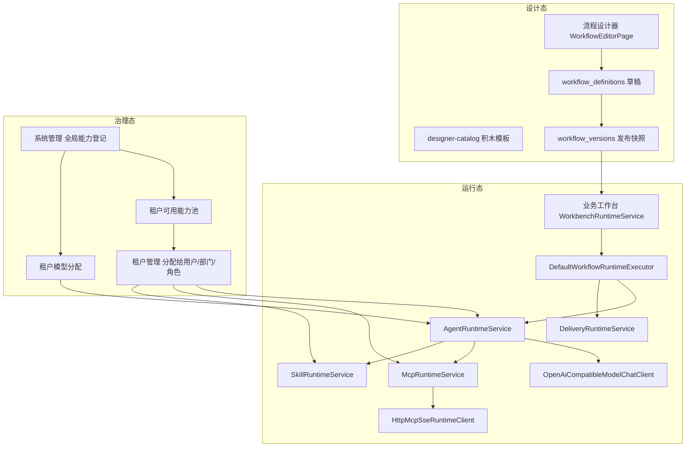

# AI 运行态接入说明

更新时间：2026-06-09

本文档说明 **当前代码** 如何把业务流程与 AI 模型、MCP、提示词模板等能力关联起来，重点回答：

- 流程跑到智能体节点时，谁在调用模型？
- MCP / Skill / 提示词模板分别落在哪一层？
- 调用结果写到哪里、前端从哪里看到？

长期架构原则见 [架构文档](./architecture.md)；能力治理见 [能力—流程—权限治理](./capability-workflow-governance.md)。

---

## 1. 一句话结论

当前第一版运行态的真实链路是：

```text
业务工作台发起任务
  -> 基于已发布流程版本生成不可变运行快照
  -> WorkbenchRuntimeService 按节点顺序推进
  -> 遇到用户输入 / 人工审核：暂停并生成待办
  -> 遇到智能体 / 集群 / 交付：交给 WorkflowRuntimeExecutor
       -> 智能体节点进入 AgentRuntimeService ReAct 循环
       -> 模型按当前节点可用工具自主选择 Skill / MCP / final_answer
       -> MCP 与 Skill 只在模型选择对应工具后执行
       -> 或执行交付能力（站内 / 邮件 / Webhook）
  -> 节点输出写入变量快照、模型/MCP/交付日志
  -> 前端通过 SSE 展示阶段、工具调用和 Markdown final_answer
```

**智能体节点采用 Agent ReAct 模式：模型拿到当前节点可用 Skill / MCP 的工具声明，自主调用工具，最后必须通过 `final_answer` 工具提交 Markdown 结论。**

---

## 2. 总体架构



### 2.1 三层边界

| 层 | 职责 | 当前状态 |
| --- | --- | --- |
| 设计态 | 配置节点、提示词、MCP、Skill 引用、变量 | 已接入 |
| 治理态 | 登记能力、放入租户池、分配给主体、分配模型 | 已接入 |
| 运行态 | 真正调用模型 / MCP / Skill / 交付并留痕 | Agent 工具调用循环已接入 |

---

## 3. 从发起到执行的完整链路

### 3.1 发起任务

入口：

- 前端：`apps/web/src/surfaces/workbench/WorkbenchShell.tsx`
- API：`POST /api/tenants/{tenantId}/workbench/runs`
- 服务：`WorkbenchRuntimeService.createRun`

关键行为：

1. 读取流程**最新发布版本** `workflow_versions.definition_snapshot`，不回读可变草稿。
2. 创建 `workflow_runs`、`workflow_node_runs`。
3. 调用 `advanceUntilPause(...)` 从第一个节点开始推进。

### 3.2 节点推进规则

`WorkbenchRuntimeService.advanceUntilPause` 按 `sort_order` 遍历节点：

| 节点类型 | 行为 |
| --- | --- |
| `user_input` / `human_review` | 标记节点 `waiting`，运行态 `paused`，写 `workflow_waiting_events` 待办 |
| `agent` / `parallel_group` / `delivery` / `trigger` / `condition` / `merge` | 标记 `running`，调用 `WorkflowRuntimeExecutor` |
| 全部完成 | 运行态 `completed` |
| 执行抛错 | 节点 `failed`，运行态 `failed` |

人工节点不会直接调 AI；AI 相关调用只发生在自动执行节点。

### 3.3 节点执行分发

`DefaultWorkflowRuntimeExecutor` 是运行态汇聚入口：

```text
trigger      -> 本地生成占位输出
agent        -> AgentRuntimeService 暴露 Skill / MCP / final_answer 工具，由模型自主调用
parallel_group -> 逐个 clusterAgents 子配置：每个子智能体同样进入 Agent 工具调用循环
delivery     -> DeliveryRuntimeService
condition    -> 本地记录表达式
merge        -> 本地透传/合并变量
```

对应代码：

- `apps/api/src/main/java/com/agentum/workbench/application/DefaultWorkflowRuntimeExecutor.java`

---

## 4. 模型调用：智能体如何与 AI 交互

### 4.1 触发时机

只有以下路径会真正访问大模型：

- 单智能体节点 `agent`
- 智能体集群节点 `parallel_group` 中的每个子智能体

执行服务：`AgentRuntimeService.execute`

### 4.2 配置来源

节点执行时会合并两类配置：

1. **节点发布快照里的 `config_snapshot`**
   - `systemPrompt` / `userPrompt`
   - `systemPromptTemplateId` / `userPromptTemplateId`
   - `agentAssetId`（引用已发布智能体模板）
   - `modelName` / `temperature` / `maxTokens`
   - `mcpIds` / `skillIds`（转换为当前 Agent 可见工具）

2. **智能体模板资产**
   - 若 `agentAssetId` 指向租户内已发布 `agent_template`，先展开其 `config`，再被节点内联配置覆盖。

对应代码：

- `AgentRuntimeService.expandAgentConfig`
- `AgentRuntimeService.resolvePromptContent`

### 4.3 租户模型分配

模型不是节点里随便填 URL，而是：

1. 系统管理员在**系统管理**登记模型供应商 `model_providers`
2. 为租户启用模型分配 `tenant_model_assignments`
3. 运行时 `AgentRuntimeService.resolveTenantModelAssignment` 取当前租户**第一个 enabled** 的分配
4. 解密供应商 API Key，调用统一聊天客户端

这意味着：**当前租户只能用到系统分配的那套模型供应商**；节点可覆盖 `modelName`，但不能绕过租户分配。

### 4.4 Agent 循环与 Prompt 组装方式

当前实现是 **多轮 Agent Loop + OpenAI 兼容 Function Calling**：

```text
system message = 渲染后的业务 systemPrompt
                 + Agentum ReAct 运行规则
                 + 当前节点可用 Skill / MCP 摘要
user message   = 渲染后的 userPrompt
                 + 上游变量 JSON
                 + 既有工具结果 JSON
tools          = skill_xxx_read / mcp_xxx / final_answer

循环：
1. 模型决定是否调用 Skill 或 MCP。
2. 后端执行被选择的工具，校验租户能力池并写 MCP / Skill 观察结果。
3. 工具观察结果作为 tool message 回写给模型。
4. 模型继续推理，直到调用 final_answer 或达到最大循环次数。
```

模板变量替换规则：

- 支持 `{{变量名}}`
- 变量来自上游已完成节点输出 + 已有工具输出
- MCP 与 Skill 只在模型选择对应工具时由 Agent 循环执行

对应代码：

- `AgentRuntimeService.executeAgentLoop`
- `AgentRuntimeService.buildToolDefinitions`
- `AgentRuntimeService.renderTemplate`
- `OpenAiCompatibleModelChatClient`

### 4.5 支持的供应商协议

`OpenAiCompatibleModelChatClient` 当前支持：

| providerType | 协议 |
| --- | --- |
| `openai-compatible` | OpenAI Chat Completions |
| `dashscope-compatible` | 通义等 OpenAI 兼容网关 |
| `azure-openai` | Azure OpenAI Chat Completions |
| `anthropic-compatible` | **运行态暂不支持** |

请求路径默认 `/chat/completions`，可在供应商 `settings` 或节点配置中覆盖。

### 4.6 模型输出写到哪里

成功后 `AgentRuntimeService` 生成节点输出：

| 字段 | 含义 |
| --- | --- |
| `output` / `outputVariable` | 节点声明的输出变量名，默认 `agent_response` |
| `final_answer` | 模型最终提交的 Markdown 业务结论 |
| `summary` | 截断后的摘要，供工作台 UI 展示 |
| `toolCalls` | 本次 Agent 循环实际调用过的 Skill / MCP 摘要 |
| `modelCallLogIds` / `modelCallLogId` | 关联 `model_call_logs` |
| `modelName` | 实际使用的模型 |
| `agentMode` | 当前为 `react` |

同时写入：

- `model_call_logs`：prompt 快照、响应快照、token usage、耗时、失败原因
- `variable_snapshots`：非敏感输出变量
- `workflow_node_runs.output_snapshot`
- `workflow_run_events`：`node_completed` / `node_failed`

---

## 5. MCP：外部工具如何接入

### 5.1 治理链路

```text
capabilities/mcp-servers/<server-key>   # 自研 MCP 源码
  -> 系统管理登记为 system_capabilities(capability_type=mcp)
  -> 放入租户可用能力池 tenant_capability_grants
  -> 租户管理分配给用户/部门/角色 resource_grants
  -> 流程设计节点配置 mcpIds
  -> 发布版本冻结到 config_snapshot
```

设计态保存/发布时，`WorkflowNodeConfigValidator` 会校验：

- MCP 是否在租户能力池内
- 当前设计者是否被分配了该 MCP

### 5.2 运行时调用顺序

对 `agent` 节点，MCP 由 Agent ReAct 循环暴露为模型工具：

```text
1. AgentRuntimeService.resolveMcpTools 读取当前节点 mcpIds。
2. 每个 MCP 能力转换为一个 OpenAI function tool。
3. 模型在需要事实数据或外部系统动作时选择对应工具。
4. AgentRuntimeService 调用 McpRuntimeService.executeResolvedTool。
5. MCP 观察结果作为 tool message 回写给模型继续推理。
```

运行时入口：`McpRuntimeService.resolveMcpTools` 声明工具，`McpRuntimeService.executeResolvedTool` 执行模型选中的 MCP 调用。

### 5.3 节点配置字段

`config_snapshot` 中常见字段：

| 字段 | 作用 |
| --- | --- |
| `mcpIds` / `mcpServices` | 绑定的 MCP 能力 ID 列表 |
| `toolName` / `mcpToolName` | 远端 MCP 工具名；未配置时回退到能力 `defaultToolName` 或 `code` |

模型通过 Function Calling 传入 `arguments` 对象；`McpRuntimeService.executeResolvedTool` 将其解包后发起 `tools/call`。生产能力应在系统管理配置 `defaultToolName` 或在节点显式配置 `toolName`，避免模型选到无法执行的远端工具。

### 5.4 运行时协议

实现类：`HttpMcpSseRuntimeClient`

协议步骤：

1. 连接 MCP 的 `sseUrl`
2. 读取 SSE endpoint
3. 发送 JSON-RPC `initialize`
4. 发送 `notifications/initialized`
5. 发送 `tools/call`
6. 解析工具结果

安全与治理：

- 校验 MCP 属于当前租户能力池
- 请求/日志中对敏感字段脱敏
- 全量写入 `mcp_call_logs`

### 5.5 本地演示 MCP

仓库自带演示服务：

- `capabilities/mcp-servers/agentum-test-mcp/`
- 需在系统管理中登记其 SSE 地址后，才能在流程节点里选用

---

## 6. Skill：当前做到哪一步

### 6.1 现在已有什么

Skill 在当前代码里已经进入智能体运行时，但定位不是“后端硬编码函数”，而是模型可按需阅读的能力说明书：

| 能力 | 状态 |
| --- | --- |
| 系统管理登记 Skill | 已支持 |
| 读取 `capabilities/skills/<key>/SKILL.md` + `skill.yaml` 探测 | 已支持 |
| 租户能力池 / 分配 | 已支持 |
| 流程设计器选择 `skillIds` | 已支持 |
| 发布校验引用是否在能力池内 | 已支持 |
| 运行时把 Skill 作为模型工具读取 | 已支持 |

对应代码：

- 探测：`FilesystemSkillManifestProbe`
- 设计态校验：`WorkflowNodeConfigValidator`
- 运行时：`SkillRuntimeService.resolveSkillTools` / `SkillRuntimeService.readSkill`

### 6.2 设计意图

当前 Skill 工具的行为：

- 节点配置 `skillIds` 后，AgentRuntimeService 为每个 Skill 暴露 `skill_xxx_read` 工具。
- 模型只有在需要理解方法论、提示策略或操作指南时才读取 Skill。
- 文件读取限定在该 Skill 的 `SKILL.md` 同目录下，禁止绝对路径和 `..` 越权。
- 单次读取内容会截断，避免把过长文档一次性塞进上下文。

后续可以在当前基础上扩展 Skill 脚本执行、Skill 版本快照和更细的工具审批，但不能绕过租户能力池与运行审计。

---

## 7. 提示词模板

提示词模板有两条使用路径。

### 7.1 系统级提示词模板

- 登记在 `system_capabilities(capability_type=prompt_template)`
- 进入租户能力池后可被流程节点或智能体模板引用

运行时解析：

- 节点或模板配置 `systemPromptTemplateId` / `userPromptTemplateId`
- `AgentRuntimeService.resolvePromptContent` 读取 `promptContent`
- 找不到则回退到节点内联 `systemPrompt` / `userPrompt`

### 7.2 租户自建提示词模板

- 资产类型：`tenant_asset_capabilities(asset_type=prompt_template)`
- 只有**已发布**模板可被智能体模板或流程引用
- 运行时会按租户边界校验 ID 归属

---

## 8. 智能体模板

智能体模板是「可复用的 Agent 配置包」，不是独立执行服务。

当前作用：

1. 在能力资产页由用户组合系统提示词、Skill/MCP 引用等
2. 发布后在流程节点里通过 `agentAssetId` 引用
3. 运行时由 `AgentRuntimeService.expandAgentConfig` 展开到节点配置

注意：

- 模板里的 `skillIds` / `mcpIds` 会随 `expandAgentConfig` 展开到节点配置，进入 Agent ReAct 循环后分别由 `SkillRuntimeService` 和 `McpRuntimeService` 暴露为模型工具

---

## 9. 交付节点

`delivery` 节点由 `DeliveryRuntimeService` 执行，不走大模型。

支持模式：

| deliveryMode | 行为 |
| --- | --- |
| `direct` | 站内直接完成，写 `delivery_records` |
| 其他 | 解析绑定的交付能力，按通道执行 |

已落地通道：

- 系统内置邮箱：`EmailDeliveryService`
- Webhook：HTTP POST
- 自定义交付能力：读取系统登记配置

交付结果写入：

- `delivery_records`
- 节点 `output_snapshot`
- 变量快照（按配置）

---

## 10. 变量如何在节点间传递

当前变量机制比较直接：

1. 每个已完成节点把 `output_snapshot` 合并进 `currentVariables`
2. 下游节点执行时拿到这个 Map
3. Prompt / MCP 参数中的 `{{变量名}}` 从这里取值
4. 非敏感结果额外写入 `variable_snapshots`

尚未实现：

- 复杂变量类型系统
- 运行中动态追问改写变量
- 并行分支精细合并策略

---

## 11. 前端如何看到 AI 结果

业务工作台不会直接连模型，只调后端运行接口：

| 前端动作 | API |
| --- | --- |
| 发起任务 | `POST /workbench/runs` |
| 查看运行详情 | `GET /workbench/runs/{runId}` |
| 完成待办 | `POST /workbench/todos/{todoId}/complete` |
| 流式进度（支持断线续传与整步回放） | `GET /workbench/runs/{runId}/stream?lastEventId=&replay=` |
| 推进下一步（入队执行，立即返回含 `activeJob`） | `POST /workbench/runs/{runId}/advance` |
| 主动中断（节点置 `canceled` 并清空本步数据） | `POST /workbench/runs/{runId}/interrupt` |
| 主动「重新执行」（整步从头重跑） | `POST /workbench/runs/{runId}/nodes/{nodeRunId}/restart` |
| 被动「恢复进度」（保留已成功子智能体，只重跑失败部分） | `POST /workbench/runs/{runId}/nodes/{nodeRunId}/recover` |

`TaskRunWorkspace.buildRuntimePreviewFromRun` 把后端返回的：

- `nodes[].outputs.final_answer`
- `nodes[].outputs.toolCalls`
- `nodes[].state`
- `events[]`

渲染成「当前处理 / 执行历史 / 交付物」页面。Agent 输出使用 `react-markdown` + `remark-gfm` 渲染 Markdown，执行历史不再重复展示节点列表，而是依赖左侧流程轨选择节点，右侧展示选中步骤快照与事件时间线。

SSE 事件目前包括：

| 事件 | 含义 |
| --- | --- |
| `node_started` | 当前节点开始执行 |
| `agent_thinking` | Agent 阶段变化，如准备、模型推理、工具调用、验证 |
| `agent_tool_call` | 单智能体 Skill / MCP 工具调用状态 |
| `agent_streaming` | final_answer 流式文本 |
| `cluster_agent` | 子智能体阶段、工具调用、流式输出和完成状态 |
| `node_completed` / `node_failed` | 节点完成或失败 |
| `run_paused` / `run_completed` | 流程暂停或完成 |
| `heartbeat` | Worker 每 15s 心跳，前端看门狗据此判定后台执行是否存活 |

事件由 Worker 写入 Redis Stream（`run:{runId}:events`），API 中继为 SSE；每条消息携带 `id`（Redis 记录 ID），前端刷新用 `?replay=true` 整步回放、断线用 `?lastEventId=` 续传，做到刷新/重进无感恢复。

前端**不会**发起模型或 MCP 请求；所有 AI 调用都在后端完成。

---

## 12. 运行留痕表

| 表 | 记录什么 |
| --- | --- |
| `workflow_runs` | 一次任务实例 |
| `workflow_node_runs` | 每个节点状态、输入输出快照、配置快照 |
| `workflow_waiting_events` | 待办 |
| `workflow_run_events` | 运行事件时间线 |
| `workflow_run_execution_jobs` | 节点执行作业（幂等键、attempt、deadline、worker），异步执行与回收判定依据 |
| `workflow_cluster_agent_runs` | 集群子智能体逐个落库的结果与错误，支撑「恢复进度」部分重跑 |
| `variable_snapshots` | 变量勾稽 |
| `model_call_logs` | 模型请求/响应摘要 |
| `mcp_call_logs` | MCP 工具调用 |
| `delivery_records` | 交付执行记录 |

---

## 13. 当前边界与后续计划

### 13.1 已实现

- 租户级模型供应商分配与真实 Chat Completions 调用
- 单智能体 / 智能体集群节点执行
- OpenAI 兼容 Function Calling 工具声明
- Agent 多轮工具调用循环和 `final_answer`
- Skill 运行时读取工具
- MCP SSE `tools/call` 与租户能力池授权校验
- 提示词模板、智能体模板在运行时的配置展开
- SSE 流式运行事件与前端 Markdown 展示
- 交付节点与运行失败留痕
- 用户输入 / 人工审核暂停恢复
- 异步执行内核：RabbitMQ 节点作业 + Redis Stream 进度回放 + 执行租约 + 超时回收（仅 async 模式，原 `@Async` 路径已删除）
- 中断/恢复语义：主动中断清空数据后「重新执行」、被动失败保留已成功子智能体后「恢复进度」
- 智能体集群 `parallel` 真并发 / `sequential` 顺序执行，子智能体结果逐个落库
- 模型瞬时错误（429/5xx 类）有限次自动重试（attempt ≤ 3）

### 13.2 尚未实现

- 智能体追问追加上下文接口
- 高风险 MCP / 交付人工审批
- 独立进程 Worker、复杂文档生成长任务
- 完整运行审计独立页面（当前工作台只做业务处理视图）

### 13.3 异步执行架构

运行态执行架构详见：[运行态异步执行设计（MQ + Redis）](./runtime-async-execution-design.md)（已落地，文档头部含实现状态说明）。本地开发必须先 `make dev-infra` 启动 Redis 与 RabbitMQ。

---

## 14. 关键代码索引

| 主题 | 路径 |
| --- | --- |
| 运行编排（advance 入队 / 中断 / restart / recover） | `apps/api/.../workbench/application/WorkbenchRuntimeService.java` |
| Worker 节点执行（消费 MQ、租约、心跳、集群并发） | `apps/api/.../workbench/application/NodeExecutionService.java` |
| 异步执行内核（命令、租约、取消、回收、Stream 中继） | `apps/api/src/main/java/com/agentum/runtime/` |
| 节点分发 | `apps/api/.../workbench/application/DefaultWorkflowRuntimeExecutor.java` |
| 模型调用 | `apps/api/.../agent/application/AgentRuntimeService.java` |
| 聊天客户端 | `apps/api/.../agent/infrastructure/OpenAiCompatibleModelChatClient.java` |
| Skill 运行时 | `apps/api/.../agent/application/SkillRuntimeService.java` |
| MCP 运行时 | `apps/api/.../mcp/application/McpRuntimeService.java` |
| MCP SSE 客户端 | `apps/api/.../mcp/infrastructure/HttpMcpSseRuntimeClient.java` |
| 交付运行时 | `apps/api/.../delivery/application/DeliveryRuntimeService.java` |
| 设计态能力校验 | `apps/api/.../workflow/application/WorkflowNodeConfigValidator.java` |
| Skill 源文件探测 | `apps/api/.../system/infrastructure/FilesystemSkillManifestProbe.java` |
| 流程设计器 | `apps/web/src/surfaces/designer/WorkflowEditorPage.tsx` |
| 业务工作台运行页 | `apps/web/src/components/runtime/TaskRunWorkspace.tsx` |
| 前端 SSE 流 Hook（回放/续传/心跳） | `apps/web/src/hooks/useRunStream.ts` |
| 能力源码目录 | `capabilities/` |

---

## 15. 配置一条可运行的 AI 流程，最少需要做什么

1. **系统管理**
   - 登记并测试模型供应商
   - 为演示租户启用模型分配
   - 如需 MCP：登记 MCP 能力并填写 `sseUrl`

2. **租户管理**
   - 把 Skill / MCP / 提示词模板 / 交付能力分配给目标用户或角色

3. **流程设计**
   - 添加「用户输入」节点
   - 添加「单智能体」或「智能体集群」节点，配置提示词，按需选择 Skill / MCP
   - 添加「交付」节点
   - 发布流程

4. **业务工作台**
   - 发起任务 -> 保存 -> 填写待办 -> 观察后续节点自动调用 MCP/模型/交付

如果只配置智能体节点、不配置 MCP，则会直接进入模型调用；如果租户未分配模型，会在 `AgentRuntimeService` 处失败并标记节点失败。
