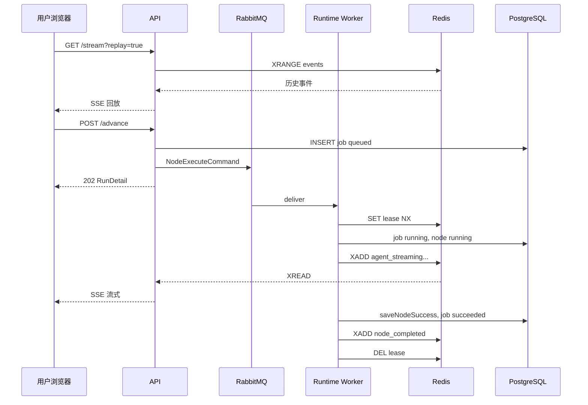

# 运行态异步执行设计（MQ + Redis）

更新时间：2026-06-10

本文档描述 Agentum 工作流运行态从「单进程 `@Async` + 内存 SSE」演进到「RabbitMQ 执行 + Redis 协调与进度回放」的目标架构、消息契约、数据变更与分阶段落地计划。

> **落地状态（2026-06-10）：核心架构已实现，且仅保留 async 模式。**
>
> - `@Async` 推进路径、内存 `RunStreamEmitterRegistry` / `RunExecutionCancellationRegistry` 已删除，运行态强依赖 Redis + RabbitMQ（本地先执行 `make dev-infra`）。
> - 已落地组件：`com.agentum.runtime` 包（命令发布/消费、`RunExecutionLeaseService` 租约、`RunProgressStreamWriter` / `RunStreamRelayService` Redis Stream 进度回放、`StaleExecutionReaper`、`RedisRunCancellationGuard` 取消/超时信号）与 Worker 侧 `NodeExecutionService`。
> - 新增数据表：`workflow_run_execution_jobs`（执行作业，幂等/重试/回收判定）、`workflow_cluster_agent_runs`（子智能体结果逐个落库，支撑部分恢复）。
> - 交互语义：主动中断 → 节点 `canceled` + 数据清空 + 「重新执行」（`POST .../nodes/{nodeRunId}/restart`）；被动失败（模型错误/超时/失联）→ 节点 `failed` + 保留已成功子智能体 + 「恢复进度」（`.../recover`）。
> - 集群节点 `config.executionMode` 支持 `collaborative`（协同处理，受 `cluster-parallelism` 限流）、`relay`（接力处理，后续子智能体可引用前序输出）与 `intent`（意图分派，先按 `intentRoutes` 分类，再只执行命中子智能体；多个命中按意图清单顺序写入集群输出模板）；历史 `parallel` / `sequential` 数据由迁移脚本清洗为新枚举，运行态不再保留旧值兼容分支。
> - 节点执行超时通过环境变量 `AGENTUM_RUNTIME_NODE_TIMEOUT_SECONDS`（默认 1800s）控制。
> - 文中提到的 `inline` 模式与 `runtime.execution.mode` 开关为历史迁移方案，未予保留，仅作设计过程记录。

相关文档：

- [AI 运行态接入说明](./ai-runtime-integration.md) — 当前已实现的模型 / MCP / Skill 调用链
- [架构文档](./architecture.md) — 模块边界与中间件选型
- [当前进度](./progress/README.md) — 施工状态

---

## 1. 背景与目标

### 1.1 历史实现（阶段 0，已删除）

```text
POST /advance
  -> WorkbenchRuntimeService.advanceSingleStep (@Async)
  -> 同步调用 AgentRuntimeService / DeliveryRuntimeService
  -> 通过 RunStreamEmitterRegistry 向内存 SseEmitter 推送
  -> 完成后写 PostgreSQL（节点状态、outputs、留痕表）
```

该模型在**单实例、用户保持页面打开、链路较短**时可工作，但存在以下结构性风险（因此已整体替换为 async 模式，不再保留 inline 回退）：

| 风险 | 表现 |
| --- | --- |
| 进程重启 | `@Async` 线程消失，节点长期 `running` |
| 多 API 实例 | 内存 SSE 注册表、推进锁不可共享 |
| 刷新 / 重进 | 流式 token 丢失，只能靠 DB 最终结果或前端启发式 re-advance |
| 长任务 | HTTP 线程池与 SSE 超时（当前 300s）成为隐性上限 |
| 重复推进 | `advancingRuns` 仅进程内有效 |

### 1.2 设计目标

1. **执行与连接解耦**：浏览器 SSE 只负责「看进度」，节点执行在 Worker 中完成，API 重启不丢任务。
2. **可重连接入**：用户刷新或重新打开任务页，能恢复「当前步骤 + 流式累积内容 + 事件时间线」。
3. **多实例安全**：同一 `runId` 同一时刻最多一个执行租约；SSE 可在任意 API 实例建立。
4. **失败可感知**：超时、Worker 崩溃、模型/MCP 失败均写入 DB 与事件流，前端不再假「执行中」。
5. **渐进迁移**：开发期曾计划 `inline` / `async` 双模式；落地后仅保留 `async`，本地也必须先启动 Redis 与 RabbitMQ。

### 1.3 非目标（本阶段不做）

- 独立 Python Worker、复杂文档生成流水线（仍归 `workers/` 后续模块）
- 运行中动态追问、取消补偿的完整产品闭环（仅预留 cancel 消息）
- Kafka 级海量事件归档（PostgreSQL + Redis Stream 截断即可满足阶段二）

---

## 2. 目标架构总览

```text
┌─────────────┐     GET /stream?lastEventId=     ┌──────────────┐
│  Web 前端   │◄──────── SSE ────────────────────│   API 集群    │
└──────┬──────┘                                  │              │
       │ POST /advance                           │  StreamRelay │
       └────────────────────────────────────────►│  (XREAD SUB) │
                                                 └───────┬──────┘
                                                         │
                    ┌────────────────────────────────────┼────────────────────┐
                    │                                    │                    │
                    ▼                                    ▼                    ▼
             ┌─────────────┐                    ┌─────────────┐      ┌──────────────┐
             │  PostgreSQL │◄─── 状态 / 快照 ───│ Runtime     │─────►│ Redis        │
             │  (事实源)    │                    │ Worker      │      │ Stream+Lease │
             └─────────────┘                    └──────▲──────┘      └──────────────┘
                                                       │
                                                       │ consume
                                                ┌──────┴──────┐
                                                │  RabbitMQ   │
                                                │ node.execute│
                                                └─────────────┘
```

**职责划分：**

| 组件 | 职责 |
| --- | --- |
| PostgreSQL | 运行实例、节点状态、outputs、审计事件、执行作业记录（事实源） |
| RabbitMQ | 节点执行命令投递、重试、死信 |
| Redis Stream | 热进度事件（SSE 回放 + 跨实例 fan-out） |
| Redis String/Hash | 执行租约、流式累积快照、取消信号 |
| API | 鉴权、推进请求入队、SSE 订阅 Redis、DB 详情查询 |
| Runtime Worker | 消费作业、调用现有 `AgentRuntimeService` 等、写 DB + 推 Redis |

---

## 3. 执行模式与配置

当前仅保留 **async** 模式：`POST /advance` 入队后立即返回；Worker 消费 RabbitMQ 执行；SSE 由 Redis Stream 中继。

`application.yml`（或环境变量）示例：

```yaml
agentum:
  runtime:
    redis:
      stream-max-len: 5000          # 每个 run 的 Stream 最大条目（近似裁剪）
      lease-ttl-seconds: 7200       # 执行租约 TTL，Worker 心跳续期
      stale-node-threshold-seconds: 1800
    rabbitmq:
      exchange: agentum.runtime
      queue-node-execute: runtime.node.execute
      queue-node-execute-dlq: runtime.node.execute.dlq
      prefetch: 1                   # 单 Worker 同时只处理一个长任务
```

本地开发必须先执行 `make dev-infra` 启动 Redis 与 RabbitMQ，否则运行态无法推进节点。

---

## 4. RabbitMQ 设计

### 4.1 拓扑

```text
Exchange: agentum.runtime (topic, durable)

Routing keys:
  runtime.node.execute          -> queue runtime.node.execute
  runtime.node.execute.dlq      -> queue runtime.node.execute.dlq
  runtime.node.cancel           -> queue runtime.node.cancel (阶段 B+)
```

队列参数建议：

- `runtime.node.execute`：`x-dead-letter-exchange=agentum.runtime`，`x-dead-letter-routing-key=runtime.node.execute.dlq`
- 消息 TTL：不在队列层设全局 TTL；由业务层 `workflow_run_execution_jobs.deadline_at` 控制

初始化脚本位置：`deploy/local/rabbitmq/`（与 [deploy/local/README.md](../deploy/local/README.md) 约定一致）。

### 4.2 消息体：`NodeExecuteCommand`

契约文件（新增）：`packages/shared-contract/events/node-execute-command.schema.json`

```json
{
  "schemaVersion": 1,
  "jobId": "uuid",
  "tenantId": "uuid",
  "runId": "uuid",
  "nodeRunId": "uuid",
  "nodeType": "agent",
  "operatorUserId": "uuid",
  "requestId": "string",
  "idempotencyKey": "runId:nodeRunId:attempt",
  "attempt": 1,
  "enqueuedAt": "2026-06-09T12:00:00Z"
}
```

| 字段 | 说明 |
| --- | --- |
| `jobId` | 对应 DB `workflow_run_execution_jobs.id` |
| `idempotencyKey` | 防重复消费；Worker 开始前查 DB 状态 |
| `attempt` | 人工重试或自动重试次数 |

### 4.3 消费流程（Worker）

```text
1. 收到 NodeExecuteCommand
2. Redis SET run:{runId}:lease NX EX leaseTtl  -> 失败则 nack requeue（其他 Worker 在执行）
3. 加载 run / nodeRun，校验 node.state in (pending, running) 且 job.status = queued
4. 标记 job -> running，node -> running，写 node_started 事件
5. 调用现有执行器（与 WorkbenchRuntimeService 内分支一致）：
     agent / parallel_group -> AgentRuntimeService（流式回调 -> Redis Stream）
     delivery               -> DeliveryRuntimeService
     其他                    -> DefaultWorkflowRuntimeExecutor
6. 成功 -> saveNodeSuccess，发 node_completed / run_paused|run_completed，job -> succeeded
7. 失败 -> saveNodeFailure，发 node_failed，job -> failed
8. 释放租约（DEL 或 CAS 比较 workerId 后 DEL）
9. basicAck
```

**重试策略：**

| 错误类型 | 处理 |
| --- | --- |
| 模型 429 / 5xx | 有限次 requeue（attempt ≤ 3，指数退避） |
| 业务 ApiException | 不重试，直接 failed |
| Worker 崩溃 / 租约过期 | 定时 StaleReaper 将 job 标 failed 或 requeue（见 §7） |

### 4.4 Worker 部署形态

**阶段 B1（推荐先做）**：与 API 同 JVM，`@RabbitListener` 独立线程池，复用 Spring 容器内的 `AgentRuntimeService`。

**阶段 B2**：`apps/runtime-worker` 或 `workers/runtime-java`，仅依赖 domain + infrastructure 模块，水平扩展。

---

## 5. Redis 设计

### 5.1 Key 约定

| Key | 类型 | 用途 | TTL |
| --- | --- | --- | --- |
| `run:{runId}:lease` | String | 值 `{workerId}:{jobId}`，执行互斥 | `lease-ttl-seconds`，Worker 每 30s 续期 |
| `run:{runId}:events` | Stream | SSE 进度事件，支持 `XREAD` / `XRANGE` | `MAXLEN ~ stream-max-len` |
| `run:{runId}:stream:{nodeRunId}` | Hash | `accumulatedContent`、`updatedAt` | 与 run 生命周期一致，完成后 24h |
| `run:{runId}:cancel` | String | `"1"` 表示用户请求取消 | 1h |

### 5.2 Stream 事件格式

与现有 SSE 事件名保持一致，便于前端复用 `useRunStream`：

```text
Stream entry:
  field eventName = agent_streaming
  field payload   = JSON（与 runtime-events.schema.json 对应类型一致）
  field seq       = 单调递增 long（Redis ID 或业务 seq）
  field emittedAt = ISO-8601
```

**写入方**：Worker（及 API 在 inline 模式下可双写，便于对比测试）。

**读取方**：API 内 `RunStreamRelayService`：

1. 客户端 `GET /stream?lastEventId={redisStreamId}`  
2. `XRANGE run:{runId}:events (lastEventId +`  
3. 阻塞 `XREAD BLOCK 15000` 推送新事件  
4. 无连接时不消费（按 runId 独立协程/线程，连接关闭即停止）

### 5.3 租约与 Stale 检测

Worker 执行循环内：

```text
每 30s: EXPIRE run:{runId}:lease leaseTtl
```

API 侧 `StaleExecutionReaper`（`@Scheduled`，仅 async 模式）：

```text
扫描 workflow_node_runs.state = running
  AND started_at < now() - staleNodeThreshold
  AND 无有效 Redis lease
-> saveNodeFailure(WORKBENCH_NODE_EXECUTION_STALE, ...)
-> job 标 failed 或允许用户「重新执行」
```

---

## 6. 数据库变更

### 6.1 新表：`workflow_run_execution_jobs`

```sql
CREATE TABLE workflow_run_execution_jobs (
    id UUID PRIMARY KEY DEFAULT gen_random_uuid(),
    tenant_id UUID NOT NULL REFERENCES tenants (id) ON DELETE CASCADE,
    run_id UUID NOT NULL REFERENCES workflow_runs (id) ON DELETE CASCADE,
    node_run_id UUID NOT NULL REFERENCES workflow_node_runs (id) ON DELETE CASCADE,
    status VARCHAR(30) NOT NULL,  -- queued | running | succeeded | failed | canceled
    attempt INT NOT NULL DEFAULT 1,
    idempotency_key VARCHAR(200) NOT NULL,
    operator_id UUID REFERENCES users (id) ON DELETE SET NULL,
    request_id VARCHAR(64),
    error_code VARCHAR(80),
    error_message VARCHAR(600),
    enqueued_at TIMESTAMPTZ NOT NULL DEFAULT now(),
    started_at TIMESTAMPTZ,
    finished_at TIMESTAMPTZ,
    deadline_at TIMESTAMPTZ,
    worker_id VARCHAR(120),
    updated_at TIMESTAMPTZ NOT NULL DEFAULT now()
);

CREATE UNIQUE INDEX uk_run_execution_jobs_idempotency
    ON workflow_run_execution_jobs (idempotency_key);
CREATE INDEX idx_run_execution_jobs_run_status
    ON workflow_run_execution_jobs (run_id, status, enqueued_at DESC);
CREATE INDEX idx_run_execution_jobs_stale
    ON workflow_run_execution_jobs (status, started_at)
    WHERE status IN ('queued', 'running');
```

**说明：**

- 每次 `advance` 创建一条 `queued` 作业；Worker 完成后终态。
- `GET /runs/{id}` 可附带 `activeJob` 摘要（status、startedAt），供前端判断是否在执行。

### 6.2 现有表扩展（可选，阶段 A 可先不加列）

`workflow_node_runs` 已有 `started_at` / `completed_at`，足够 Stale 检测。若需显式关联：

```sql
ALTER TABLE workflow_node_runs
    ADD COLUMN IF NOT EXISTS active_job_id UUID REFERENCES workflow_run_execution_jobs (id);
```

### 6.3 事件表与 Stream 的关系

| 存储 | 内容 | 生命周期 |
| --- | --- | --- |
| `workflow_run_events` | 业务里程碑（节点完成、失败、暂停） | 永久审计 |
| Redis Stream | 高频流式（agent_streaming、tool_call、cluster_agent） | 热数据，MAXLEN 裁剪 |
| Redis Hash | 当前节点 `accumulatedContent` 快照 | 重连时快速恢复 UI |

Worker 在 `node_completed` / `node_failed` 时**同时**写 DB 事件与 Redis Stream，保证详情页与 SSE 一致。

---

## 7. API 变更

### 7.1 `POST /runs/{runId}/advance`

**inline 模式（不变）**：同步触发 `@Async`，响应体仍为 `RunDetail`。

**async 模式**：

```text
1. 鉴权 + prepareNextNode（与现逻辑相同，确定 nodeRunId）
2. 若已有 queued/running job -> 409 WORKBENCH_ADVANCE_ALREADY_IN_FLIGHT
3. INSERT workflow_run_execution_jobs (queued)
4. publish NodeExecuteCommand
5. 返回 202 Accepted + RunDetail（节点可能仍为 pending，activeJob.status=queued）
```

响应扩展（`RunDetail`）：

```json
{
  "activeJob": {
    "jobId": "...",
    "status": "queued",
    "nodeRunId": "...",
    "attempt": 1,
    "enqueuedAt": "..."
  }
}
```

### 7.2 `GET /runs/{runId}/stream`

新增 Query：

| 参数 | 说明 |
| --- | --- |
| `lastEventId` | Redis Stream ID；缺省从 `$` 仅收新事件 |
| `replay` | `true` 时从 `0-0` 回放最近 MAXLEN 内事件（重进页面用） |

**inline 模式**：仍走内存 `RunStreamEmitterRegistry`；可选双写 Redis 便于切 async。

**async 模式**：仅 `RunStreamRelayService` 读 Redis；不再依赖内存 emitter 传 progress。

连接建立后首条：

```json
{ "event": "connected", "runId": "...", "mode": "async", "lastEventId": "..." }
```

### 7.3 新增（可选）`GET /runs/{runId}/progress`

用于 SSE 不可用时的轮询兜底：

```text
返回：activeJob、currentNode、accumulatedContent（来自 Redis Hash）、recentEvents（Stream 末 20 条）
```

### 7.4 新增（阶段 C）`POST /runs/{runId}/cancel`

```text
SET run:{runId}:cancel 1 EX 3600
publish runtime.node.cancel
Worker 在模型轮次间隙检查 cancel -> job canceled，node failed WORKBENCH_RUN_CANCELED
```

---

## 8. 代码模块划分

### 8.1 新增包（API 内）

```text
com.agentum.runtime.execution
  RuntimeExecutionProperties
  RuntimeExecutionMode

com.agentum.runtime.messaging
  NodeExecuteCommandPublisher
  NodeExecuteCommandListener      # B1: 同 JVM Worker

com.agentum.runtime.stream
  RunProgressStreamWriter         # Worker 侧写 Redis
  RunStreamRelayService           # API 侧 SSE 中继

com.agentum.runtime.lease
  RunExecutionLeaseService

com.agentum.runtime.reaper
  StaleExecutionReaper
```

### 8.2 从 WorkbenchRuntimeService 抽取

将 `advanceSingleStep` 内「执行单个节点」核心逻辑抽为：

```java
public interface NodeExecutionHandler {
    NodeExecutionResult execute(NodeExecutionContext context, ProgressCallback callback);
}
```

`ProgressCallback` 统一：

```java
void emit(String eventName, Map<String, Object> payload);
```

inline 模式：`ProgressCallback` -> `RunStreamEmitterRegistry`  
async 模式：`ProgressCallback` -> `RunProgressStreamWriter`

**原则**：`AgentRuntimeService`、`DeliveryRuntimeService` 签名尽量不改，只在 Workbench 层注入 callback。

### 8.3 共享契约

| 文件 | 内容 |
| --- | --- |
| `packages/shared-contract/events/node-execute-command.schema.json` | MQ 命令 |
| `packages/shared-contract/events/runtime-events.schema.json` | 已有 SSE 事件，补充 `eventId`、`mode` 字段说明 |
| `packages/shared-contract/events/README.md` | 索引更新 |

---

## 9. 前端变更

### 9.1 `useRunStream`

1. 连接 SSE 时带 `?replay=true`（重进任务页）或 `lastEventId`（断线续传）。
2. 解析 SSE 自定义头或 `connected` 事件中的 `lastEventId`，持久化到 sessionStorage（key: `run-stream:{runId}`）。
3. 收到 `agent_streaming` / `cluster_agent` 时更新本地 accumulated（与现逻辑一致）。

### 9.2 `TaskRunWorkspace`

| 场景 | 行为 |
| --- | --- |
| `activeJob.status === queued/running` | 只连 SSE，**不**自动 POST advance |
| SSE 30s 无事件且 activeJob 存在 | 调 `GET /progress` 或刷新 RunDetail |
| 节点 `failed` | 展示错误 + 「重新执行」（新 attempt，新 idempotencyKey） |
| 节点 `running` 且无 activeJob | 视为 stale，允许用户确认后 re-advance |

移除或弱化「3s 无 SSE 自动 advance」启发式，改为以后端 `activeJob` + StaleReaper 为准。

### 9.3 `POST /advance` 202

前端需处理 202：`waitForAdvanceResult` 改为等待 SSE 的 `node_completed|node_failed|run_completed` 或超时。

---

## 10. 关键场景时序

### 10.1 正常执行



### 10.2 刷新页面

```text
1. GET /runs/{id} -> 节点 running + activeJob running
2. GET /stream?replay=true -> 回放 Redis Stream（含 accumulated 快照事件）
3. 不 POST /advance
4. UI 恢复到刷新前流式内容
```

### 10.3 API 重启（Worker 同 JVM）

**B1**：执行中断，租约过期，StaleReaper 标记 failed 或 requeue（可配置 `requeue-on-worker-loss`）。

**B2**：Worker 独立进程不受影响，仅 SSE 重连即可。

### 10.4 重复点击「下一步」

```text
第二次 advance -> 409 WORKBENCH_ADVANCE_ALREADY_IN_FLIGHT
或返回同一 activeJob（幂等 GET 语义，产品可选）
```

---

## 11. 错误码（新增）

| 错误码 | HTTP | 说明 |
| --- | --- | --- |
| `WORKBENCH_ADVANCE_ALREADY_IN_FLIGHT` | 409 | 已有 queued/running 作业 |
| `WORKBENCH_NODE_EXECUTION_STALE` | 409 | 节点 running 超时且无租约 |
| `WORKBENCH_RUN_CANCELED` | 409 | 用户取消 |
| `WORKBENCH_EXECUTION_LEASE_DENIED` | 503 | 租约冲突，稍后重试 |

---

## 12. 观测与运维

### 12.1 日志

所有 Worker / Relay 日志带：`requestId`、`tenantId`、`runId`、`jobId`、`nodeRunId`、`workerId`。

### 12.2 指标（Micrometer）

| 指标 | 标签 |
| --- | --- |
| `runtime.job.enqueued` | tenantId |
| `runtime.job.duration` | nodeType, status |
| `runtime.lease.conflict` | — |
| `runtime.stream.lag` | runId（采样） |
| `runtime.stale.reaped` | — |

### 12.3 RabbitMQ 管理

- 监控 `runtime.node.execute` 堆积深度
- DLQ 告警 + 人工 requeue 工具（管理端后续）

---

## 13. 分阶段落地计划

### 阶段 A：DB + Redis 租约（无 MQ，1 周）

| 任务 | 说明 |
| --- | --- |
| A1 | 迁移 `workflow_run_execution_jobs` |
| A2 | `RunExecutionLeaseService` 替换 `advancingRuns`（inline 也受益多实例 prep） |
| A3 | `StaleExecutionReaper` + 错误码 `WORKBENCH_NODE_EXECUTION_STALE` |
| A4 | `RunDetail.activeJob` 字段 |
| A5 | 前端用 activeJob 替代纯启发式 stale 检测 |

**验收**：单实例下 stale running 自动 failed；重复 advance 409。

### 阶段 B：RabbitMQ + Redis Stream（2～3 周）

| 任务 | 说明 |
| --- | --- |
| B1 | RabbitMQ 拓扑脚本 + `NodeExecuteCommand` 契约 |
| B2 | 抽取 `NodeExecutionHandler` + `ProgressCallback` |
| B3 | `@RabbitListener` Worker（同 JVM） |
| B4 | `RunProgressStreamWriter` + `RunStreamRelayService` |
| B5 | SSE `lastEventId` / `replay` + 前端 sessionStorage |
| B6 | `runtime.execution.mode=async` 配置与集成测试 |

**验收**：`async` 模式下杀 API 进程后 Worker（若独立）继续；刷新页面流式回放；多实例 SSE 任一节点可连。

### 阶段 C：增强（按需）

| 任务 | 说明 |
| --- | --- |
| C1 | 独立 `runtime-worker` 模块 |
| C2 | Cancel 消息 + 前端中断按钮 |
| C3 | `GET /progress` 轮询兜底 |
| C4 | 租户级并发限制（Redis 计数 + MQ priority） |
| C5 | inline 模式移除（默认 async） |

---

## 14. 测试策略

| 层级 | 内容 |
| --- | --- |
| 单元 | LeaseService 互斥、idempotencyKey、ProgressCallback 双实现 |
| 集成 | Testcontainers Redis + RabbitMQ；advance -> 消费 -> DB 终态 |
| 契约 | `node-execute-command.schema.json` 与 Java DTO 一致 |
| E2E | 浏览器刷新后 accumulated 恢复；并发双 advance 409 |
| 回归 | `inline` 模式全量现有 `WorkbenchRuntimeServiceTest` 通过 |

---

## 15. 与现有文档的衔接

实现完成后需回写：

- [AI 运行态接入说明](./ai-runtime-integration.md) §11 SSE、`§13 边界`
- [架构文档](./architecture.md) 运行态章节补充 Worker 与 Stream
- [当前进度](./progress/README.md) 阶段计划

---

## 16. 决策摘要

| 问题 | 决策 |
| --- | --- |
| MQ 还是 Redis 做执行？ | **RabbitMQ 执行**；Redis 不做任务持久化 |
| SSE 是否保留？ | **保留**；内容来自 Redis Stream 中继 |
| 事实源？ | **PostgreSQL**；Redis 仅热进度 |
| 第一刀改哪？ | **阶段 A 租约 + jobs 表**，风险最低 |
| Worker 语言？ | **Java 优先**，复用 `AgentRuntimeService` |
| 兼容现有 demo？ | **`inline` 模式** 长期保留至阶段 C |
